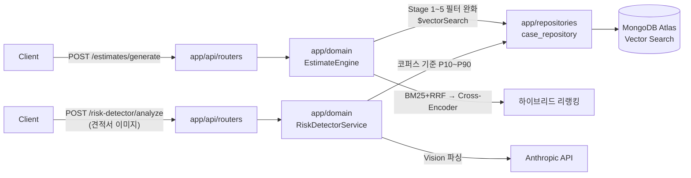

# MuneoAI

[](https://github.com/Muneo-official/Muneo-AI/actions/workflows/ci.yml)


인테리어 리모델링 **가견적 산출 + 계약서 리스크 진단** API 서버.

실제 시공 사례 통계를 근거로 가견적을 산출하고, 업로드된 견적서 이미지를 분석해
계약 리스크와 가격 이상치를 탐지한다. **가견적 "숫자" 산출에는 LLM을 쓰지 않는다** — 신뢰성과
가격 할루시네이션 방지를 위한 의도적 설계 결정이다.

---

## 배경

인테리어 견적은 표준 단가가 공개돼 있지 않고 업체별 편차가 커서, 소비자가 "이 가격이 합리적인지"
판단할 기준이 없다. 이 프로젝트는 두 가지 방식으로 그 기준을 제공한다.

1. **가견적**: 실제 계약 사례 수백 건을 크롤링해 지역·평수·자재등급 등 조건이 비슷한 사례를
   검색하고, 그 사례들의 통계(이상치 제거 후 분포)로 예상 비용 범위를 계산한다.
2. **리스크 진단**: 사용자가 받은 견적서 이미지를 업로드하면 Vision 파싱으로 항목을 구조화하고,
   같은 코퍼스 기준 가격대(P10~P90)를 벗어나는 항목을 이상치로 표시한다.

### 핵심 설계 결정

| 결정 | 이유 |
|---|---|
| **가견적 숫자 산출에 LLM 미사용** | 통계 집계는 결정론적이라 재현 가능하고 감사 가능하다. LLM에 가격 산출을 맡기면 그럴듯하지만 틀린 숫자(할루시네이션)를 낼 위험이 있고, 견적 시스템에서 이는 가장 치명적인 실패 모드다. LLM은 이미지 파싱·자연어 보조 역할로만 관여한다. |
| **적응형(adaptive) RAG — Stage 1~5 점진적 필터 완화** | 평수·지역·자재등급·공종 조건을 전부 만족하는 사례가 부족하면 조건을 단계적으로 완화해 재검색한다(self-querying 패턴). 조건을 처음부터 느슨하게 잡으면 정확도가 떨어지고, 너무 엄격하면 검색 결과가 없어지는 문제를 동시에 해결한다. |
| **Chroma + MongoDB 이중 구조 → Atlas Vector Search 단일화** | 벡터 인덱스와 원본 데이터가 분리돼 있으면 한쪽만 갱신될 때 고아 데이터가 생긴다(사례를 Mongo에서 지워도 Chroma 벡터는 남아 검색되는 등). 임베딩을 원본 문서와 같은 컬렉션·같은 write에 저장해 동기화 문제를 구조적으로 제거했다. |

---

## 검색 품질 검증

하이브리드 검색·리랭킹을 붙인 뒤, 실제로 품질이 개선됐는지 ground truth를 직접 구축해 측정했다.
TREC 스타일 pooling(쿼리당 벡터 top-40 + BM25 top-20을 합쳐 라벨링)으로 24개 쿼리에 대한 관련성
라벨을 만들고, 벡터 검색 단독과 `BM25+RRF → Cross-Encoder 리랭킹` 파이프라인을 같은 기준으로 비교했다.

| 지표 | 벡터 단독 | 하이브리드 + 리랭킹 | 변화 |
|---|---:|---:|---:|
| precision@10 | 33.8% | 38.8% | **+5.0%p** |
| precision@15 (실제 프로덕션 반환 개수) | 32.2% | 36.9% | **+4.7%p** |
| recall@15 | 29.7% | 33.3% | **+3.6%p** |

> **왜 절대 수치가 30~40%대인가**: 평가 설계 자체의 특성이다.
> ① 정답 라벨 기준이 엄격하다 — 평수 ±5평, 인접 지역, 공종 1개 이상 겹침을 **전부** 동시에
> 만족해야 relevant로 인정한다. 
> ② 베이스라인(벡터 단독)이 지역·평수 필터링을 전혀 하지 않는다
> — 순수 텍스트 유사도만으로 뽑기 때문에 서울 쿼리에 부산 사례가 올라오는 경우가 흔하고, 이게
> baseline 점수를 그대로 깎아 내린다(이 약점을 보완하려고 하이브리드+리랭킹을 붙인 것이 이 실험의
> 목적이다). 그래서 봐야 할 신호는 절대 수치가 아니라 **벡터 단독 대비 개선폭**(+4.7%p @15)이다.

검증 과정에서 "cross-encoder가 긴 텍스트에 더 높은 점수를 주는 편향"을 필러 텍스트 패딩 실험으로
인과관계까지 확인했고, 초기 실험 결과가 뒤집힌 원인(pooling 설계 결함, 순환 논리 라벨링 실수)도
찾아서 정정했다. 실패한 시도(통계적 de-biasing 등)를 포함한 전체 조사 과정은
[`eval/results/reranker_hybrid_eval.md`](eval/results/reranker_hybrid_eval.md) 참고.

가견적 정확도(공종별 가격 예측 vs 실제 사례) 진단은 [`eval/results/pricing_gap_diagnostic.md`](eval/results/pricing_gap_diagnostic.md) 참고.

---

## 아키텍처



```
app/
├── api/routers/       # HTTP 요청/응답 (얇게 유지)
├── domain/             # 비즈니스 로직 — DB 클라이언트를 모른다
├── repositories/       # DB 접근 캡슐화 ($vectorSearch 등)
├── schemas/            # Pydantic 요청/응답 모델
└── core/               # 설정(pydantic-settings), DI(lifespan), 로깅, rate limit

pipeline/   # 크롤링·이미지 파싱·데이터 적재
eval/       # 검색 품질/가견적 정확도 정량 평가 (프로덕션 eval과 분리)
scripts/    # 백필, 인덱스 세팅 등 운영 스크립트
tests/      # pytest 단위/통합 테스트 (154개)
```

- **DB**: MongoDB Atlas 하나로 통합 (Vector Search로 벡터 검색까지 처리, Chroma 없음)
- **검색**: `$vectorSearch` 필터 기반 점진적 폴백(Stage 1~5) → BM25+RRF 하이브리드 →
  (선택) Cross-encoder(`Dongjin-kr/ko-reranker`) 리랭킹 — `USE_RERANKER`로 켜고 끈다
- **보정계수**: `correction_coefficients` 컬렉션에서 버전 관리 (앱 시작 시 1회 로드)
- **LLM**: 가견적 숫자 산출엔 관여하지 않음. 견적서 이미지 Vision 파싱, 향후 자연어 요약 등
  보조 역할로만 확장 예정

---

## 기능

### 가견적 (`/estimates`)
- 공종(도배/마루/욕실/주방 등)·평수·지역·자재등급 등 구조화 입력 → 유사 시공 사례 검색 →
  통계 기반 예상 비용 범위 산출
- 견적 저장/조회/삭제, 실제 계약 금액 피드백 기록

### 리스크 진단 (`/risk-detector`)
- 견적서 이미지 업로드 → Vision API로 항목 파싱 → 코퍼스 기준 가격 분포(P10~P90) 대비 이상치 항목 탐지
- 진단 결과 저장/조회/삭제

### 공통
- 요청 ID 기반 구조화 로깅, 전역 예외 핸들러
- 엔드포인트별 rate limit (`slowapi`)

---

## 기술 스택

| 영역 | 선택 |
|---|---|
| API | FastAPI, Pydantic v2, pydantic-settings |
| DB | MongoDB Atlas ($vectorSearch, motor/pymongo) |
| 검색 | sentence-transformers(임베딩), rank-bm25(RRF), Dongjin-kr/ko-reranker(Cross-Encoder) |
| LLM | Anthropic API (견적서 이미지 Vision 파싱 전용) |
| 크롤링 | Selenium, BeautifulSoup |
| 테스트/린트 | pytest, pytest-asyncio, httpx, ruff |
| 인프라 | Docker, docker-compose, GitHub Actions |

---

## API 개요

| Method | Path | 설명 |
|---|---|---|
| POST | `/estimates/generate` | 조건 입력 → 가견적 산출 |
| POST | `/estimates/save` | 가견적 결과 저장 |
| GET | `/estimates` | 저장된 가견적 목록 |
| DELETE | `/estimates/{id}` | 가견적 삭제 |
| POST | `/estimates/{id}/feedback` | 실제 계약 금액 피드백 기록 |
| POST | `/risk-detector/analyze` | 견적서 이미지 → 리스크 진단 |
| POST | `/risk-detector/save` | 진단 결과 저장 |
| GET | `/risk-detector` | 저장된 진단 목록 |
| DELETE | `/risk-detector/{id}` | 진단 삭제 |
| GET | `/health` | 헬스체크 |

전체 Swagger 문서는 서버 실행 후 `http://localhost:8000/docs`. 요청 예시는
[`docs/API_TEST_EXAMPLES.md`](docs/API_TEST_EXAMPLES.md) 참고.

```bash
curl -X POST http://localhost:8000/estimates/generate \
  -H "Content-Type: application/json" \
  -H "x-user-id: test-user-1" \
  -d '{"공종": ["전기/조명", "도장"], "평수": 20}'
```

---

## 로컬 실행

### Docker Compose (권장)

```bash
cp .env.example .env   # ANTHROPIC_API_KEY, MONGO_URI(Atlas) 채우기
docker compose up --build
```

> `docker-compose.yml`의 `mongo` 서비스는 로컬 개발 편의용 컨테이너다. Vector Search 기능을
> 쓰려면 `MONGO_URI`가 실제 Atlas 클러스터(Search Index 설정 완료)를 가리켜야 한다.

### 로컬 venv

```bash
python -m venv .venv && source .venv/bin/activate  # Windows: .venv\Scripts\activate
pip install torch --index-url https://download.pytorch.org/whl/cpu
pip install -r requirements.txt
cp .env.example .env
uvicorn app.main:app --reload
```

### 환경변수

| 변수 | 설명 |
|---|---|
| `ANTHROPIC_API_KEY` | 견적서 이미지 Vision 파싱용 |
| `MONGO_URI` | MongoDB Atlas 연결 문자열 (Vector Search Index 필요) |
| `USE_RERANKER` | Cross-encoder 리랭킹 사용 여부(기본 `false`). `true`면 워커당 RAM +2.2GB 필요 |

---

## 테스트 & CI

```bash
ruff check app tests scripts eval
pytest -q
```

`tests/` 154개 단위/통합 테스트, GitHub Actions에서 push/PR마다 lint + test 자동 실행
([`.github/workflows/ci.yml`](.github/workflows/ci.yml)). 검색 품질/가견적 정확도 평가는
`eval/`에 별도로 분리(프로덕션 코드 회귀 테스트가 아니라 모델·파이프라인 성능 측정용).

---

## 로드맵

- [ ] 실제 계약 금액 피드백 루프로 온라인 정확도(MAPE) 측정
- [ ] 보정계수(`correction_coefficients`) 버전 추적 + 재현성 필드(`engine_version`)
- [ ] BM25/리랭킹 완화책(텍스트 캡 축소 등) 프로덕션 반영 여부 결정

더 자세한 논의는 [`docs/PORTFOLIO_UPGRADE_NOTES.md`](docs/PORTFOLIO_UPGRADE_NOTES.md) 참고.
