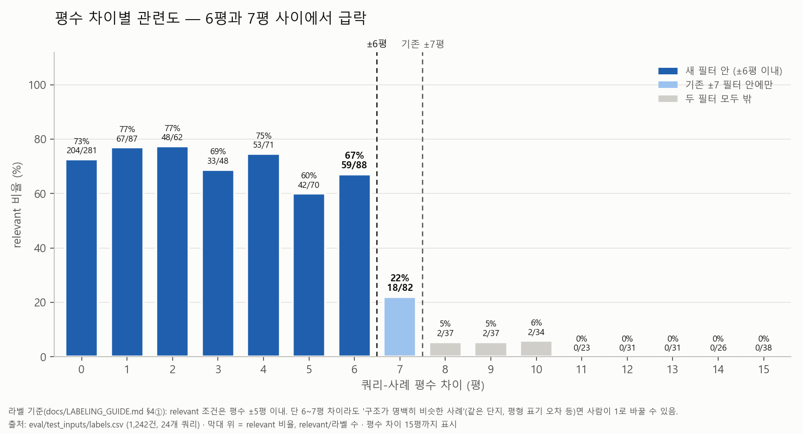

# 평수 필터 허용치(SIZE_RANGE) ±5 / ±6 / ±7 비교

> **결정: ±6으로 전환** (`SIZE_RANGE` 5→6). 정확도로 고른 게 아니다 — P@15는 ±5와 사실상 같다
> (93.1% vs 93.2%, 노이즈 범위). 정확도를 잃지 않으면서 쿼리당 참고 사례가 늘고(중앙값 15→19건),
> 사례가 부족해 지역 조건까지 풀리던 쿼리(q20)가 지역을 지키게 된다는 점을 택했다. 대가는 작은
> 평형(q22)에서 평수차 6평 사례가 섞이는 것이다.
>
> **확정 수치** — 세 허용치 모두 top-15 라벨 커버리지 100%.

## 왜 다시 보나

`SIZE_RANGE`를 7→5로 줄인 근거(a39eaf4)는 라벨 1,236건을 평수 차이별로 묶었을 때 relevant 비율이
6평 65.5%(55/84) → 7평 22.2%(18/81)로 급락한 것이었다. 그런데 급락 지점은 6과 7 사이이고, 6평 비율이
5평(60.0%, 42/70)보다 높다. 그래서 ±6이 더 자연스러운 경계인지 같은 조건에서 비교했다.

이번 라벨 보강(1,242건) 후에도 모양은 같다: 6평 67.0%(59/88) → 7평 22.0%(18/82).



(결정 전 버전 — ±5·±6 경계를 모두 표시: [`size_gap_relevance.png`](./size_gap_relevance.png))

## 방법

- **파이프라인**: `EstimateEngine.retrieve_cases()`를 그대로 호출한다. Stage 1~5 필터 →
  BM25+RRF → cross-encoder(`Dongjin-kr/ko-reranker`), 비주거 제외, 벡터 후보 풀 40건.
  평당 단가 라이브 계산은 `generate()` 쪽이라 검색 순위에는 영향이 없다.
- **허용치 변경**: 평가 때는 서비스 코드를 건드리지 않았다. `_build_filter()`가 모듈 전역 `SIZE_RANGE`를
  호출 시점에 읽으므로, 평가 스크립트 안에서만 모듈 속성을 바꿔 끼웠다
  (`eval/size_range_comparison.py`).
- **라벨**: 기존 `labels.csv` 1,236건 + 이번에 추가한 6건 = 1,242건. 세 허용치 모두 같은 라벨셋으로
  채점했다. 원본은 `labels.backup-20260929.csv`.
  - 라벨이 없는 후보 6건은 `build_pool._suggested_relevant()`(기존 규칙)로 1차 판단했다. 입력은 쿼리 조건과
    사례 필드(평수·지역·공종)뿐이고, 후보 CSV는 (쿼리, 사례) 순으로 정렬해 순위·점수 열을 넣지 않았다.
  - 규칙이 명확한 1건(q11, 평수차 0)은 규칙대로 1(`size6_rule_labels.csv`).
  - 판단이 갈리는 5건은 사람이 검토했다(`review_size6.csv`). 기준은 `flag_review_rows.py` 중 순위를 쓰지 않는
    두 가지: ① 평수 차이 6~7평이라 규칙상 0인데 지역·공종은 통과한 행, ② 규칙상 1인데 요청 공종 중
    1개만 겹치는 행. ③ "벡터/BM25 1~3위인데 0"은 순위를 봐야 해서 쓰지 않았다. 5건 모두 ①에 해당했고,
    검토 결과 평수차 6평 4건은 1, 평수차 7평 1건(q15)은 0.
- **지표**: P@k = top-k 중 relevant / 라벨 있는 수. **micro**(전체 합산, SUMMARY.md와 같은 방식)와
  **macro**(쿼리별 평균)를 같이 적었다. 후보가 k개보다 적은 쿼리는 있는 만큼만 센다.
- **불확실성**: 24개 쿼리를 복원추출하는 부트스트랩 1만 회(seed 20260929)로 micro P@15 차이의 95% 구간을
  구했다.

## 결과

| 허용치 | P@5 (micro / macro) | P@10 | P@15 | 커버리지(top-15) | 반환 사례 수 |
|---|---|---|---|---|---:|
| ±5 (이전) | 94.9% / 95.0% | 93.3% / 94.0% | **93.1%** / 93.5% | 100% (277/277) | 277 |
| **±6 (채택)** | 95.7% / 95.8% | 94.0% / 94.5% | **93.2%** / 93.4% | 100% (295/295) | 295 |
| ±7 | 90.7% / 90.8% | 87.4% / 87.8% | **82.1%** / 83.1% | 100% (313/313) | 313 |

±5 수치는 SUMMARY.md의 이전 최종 기록(93.1%)과 일치해서, 이 평가가 production 경로를 그대로 재현한다는 걸
확인했다. ±7도 과거 기록(82.5%)과 거의 같다(비주거 제외·라벨 보강 후 82.1%).

### 차이의 불확실성 (micro P@15, 쿼리 단위 부트스트랩 1만 회)

| 비교 | 관측 차이 | 95% 구간 | 쿼리 상승 / 하락 / 동일 |
|---|---:|---|---|
| ±6 − ±5 | +0.1%p | [−5.7%p, +7.1%p] | 3 / 5 / 16 |
| ±7 − ±5 | −11.0%p | [−18.5%p, −2.6%p] | 2 / 15 / 7 |
| ±7 − ±6 | −11.1%p | [−15.8%p, −6.9%p] | 1 / 14 / 9 |

±7이 나쁘다는 건 구간이 0을 넘지 않아 분명하다. **±5와 ±6의 차이는 구간이 0을 크게 걸쳐 있어 노이즈
범위다.**

### Stage 채택 분포

| 허용치 | Stage 1 | Stage 2 | Stage 3 (지역 완화) | Stage 4~5 |
|---|---:|---:|---:|---:|
| ±5 | 2 | 21 | 1 (q20) | 0 |
| ±6 | 2 | 22 | 0 | 0 |
| ±7 | 2 | 22 | 0 | 0 |

### 필터 통과 후보 수 (채택 Stage 조건 + 비주거 제외, 벡터 후보 풀 40건 캡과 무관한 전체 수)

| 허용치 | 쿼리당 중앙값 | 최소 | 합계 | top-15를 못 채운 쿼리 |
|---|---:|---:|---:|---:|
| ±5 | 15 | 4 | 869 | 12 |
| ±6 | 19 | 3 | 1,016 | 10 |
| ±7 | 27.5 | 3 | 1,205 | 7 |

±6은 후보를 쿼리당 중앙값 기준 4건 더 확보한다. 다만 후보가 적은 쿼리(q16 4건, q17 6건, q13 11건)는
±6으로 넓혀도 거의 늘지 않는다.

### 쿼리별 P@15

| 쿼리 | ±5 | ±6 | ±7 | ±6−±5 | Stage ±5/±6/±7 | 통과 후보 ±5/±6/±7 |
|---|---|---|---|---:|---|---|
| q01 | 100% (14/14) | 100% (15/15) | 100% (15/15) | +0%p | 2/2/2 | 14/20/32 |
| q02 | 100% (15/15) | 100% (15/15) | 100% (15/15) | +0%p | 2/2/2 | 115/121/124 |
| q03 | 100% (11/11) | 92% (11/12) | 67% (10/15) | −8%p | 2/2/2 | 11/12/19 |
| q04 | 100% (15/15) | 93% (14/15) | 73% (11/15) | −7%p | 2/2/2 | 90/106/141 |
| q05 | 87% (13/15) | 87% (13/15) | 87% (13/15) | +0%p | 2/2/2 | 16/18/18 |
| q06 | 100% (6/6) | 100% (7/7) | 78% (7/9) | +0%p | 2/2/2 | 6/7/9 |
| q07 | 73% (11/15) | 73% (11/15) | 73% (11/15) | +0%p | 2/2/2 | 36/39/45 |
| q08 | 86% (6/7) | 88% (7/8) | 89% (8/9) | +2%p | 2/2/2 | 7/8/9 |
| q09 | 100% (15/15) | 100% (15/15) | 80% (12/15) | +0%p | 2/2/2 | 85/93/105 |
| q10 | 100% (5/5) | 92% (11/12) | 67% (10/15) | −8%p | 2/2/2 | 5/12/16 |
| q11 | 100% (15/15) | 100% (15/15) | 93% (14/15) | +0%p | 2/2/2 | 35/39/47 |
| q12 | 93% (14/15) | 93% (14/15) | 80% (12/15) | +0%p | 2/2/2 | 37/48/68 |
| q13 | 100% (11/11) | 100% (11/11) | 92% (11/12) | +0%p | 2/2/2 | 11/11/12 |
| q14 | 100% (15/15) | 100% (15/15) | 100% (15/15) | +0%p | 2/2/2 | 110/117/119 |
| q15 | 91% (10/11) | 93% (14/15) | 80% (12/15) | +2%p | 2/2/2 | 11/16/20 |
| q16 | 100% (4/4) | 100% (4/4) | 80% (4/5) | +0%p | 1/1/1 | 4/4/5 |
| q17 | 100% (6/6) | 100% (6/6) | 100% (6/6) | +0%p | 1/1/1 | 6/6/6 |
| q18 | 100% (7/7) | 100% (12/12) | 60% (9/15) | +0%p | 2/2/2 | 7/12/23 |
| q19 | 100% (15/15) | 93% (14/15) | 87% (13/15) | −7%p | 2/2/2 | 23/42/47 |
| **q20** | 27% (3/11) | 100% (3/3) | 100% (3/3) | **+73%p** | **3**/2/2 | 11/3/3 |
| q21 | 100% (15/15) | 100% (15/15) | 100% (15/15) | +0%p | 2/2/2 | 93/105/125 |
| **q22** | 100% (4/4) | 50% (5/10) | 50% (7/14) | **−50%p** | 2/2/2 | 4/10/14 |
| q23 | 93% (14/15) | 93% (14/15) | 80% (12/15) | +0%p | 2/2/2 | 94/118/127 |
| q24 | 93% (14/15) | 93% (14/15) | 80% (12/15) | +0%p | 2/2/2 | 38/49/71 |

### ±5 → ±6에서 크게 흔들린 쿼리와 이유

- **q20 (49평·수도권·전 공종) +73%p**: ±5에서는 Stage 2 통과가 3건 미만이라 Stage 3(지역 완화)으로
  떨어졌고, 지방 사례가 섞여 3/11이었다. ±6에서는 Stage 2 통과가 딱 3건이 되어 지역을 지킨 채 멈췄다
  (3/3). **±6 이점의 대부분이 이 쿼리 하나에서 나온다.** 다만 참고 사례가 3건뿐이라 견적 분산은 커진다.
- **q22 (18평·수도권·전 공종) −50%p**: ±5에서는 4건만 통과해 전부 relevant였는데, ±6에서 평수차 6평 후보
  6건이 들어왔고 그중 5건이 기존 라벨로 0이었다(규칙상 0이고 1로 바뀌지 않은 행).
- **q10·q03·q04·q19 (−7~8%p)**: 평수차 6평 후보가 들어오며 라벨 0인 행이 1건씩 섞였다. q10은 후보가
  5→12건으로 늘어 relevant 수 자체는 5→11건으로 늘었다.
- **q12·q24·q23·q01 (P@15는 그대로)**: 평수차 6평 사례가 평수차 0~4평 사례를 밀어내고 top-15에
  들어왔다. 라벨상으로는 둘 다 relevant라 P@15에는 안 드러나지만, 가견적 참고 사례가 평수상 더 먼 쪽으로
  바뀐 것이다. cross-encoder가 평수 차이를 순위에 거의 반영하지 않기 때문이다.

## 해석

1. **±7은 확실히 나쁘다.** ±5·±6 둘 다보다 11%p 낮고 부트스트랩 구간도 0을 넘지 않는다. a39eaf4의
   결정(±7 폐기)은 이번 비교로도 유지된다.
2. **±5와 ±6은 이 표본으로 구별되지 않는다.** micro P@15 차이 +0.1%p, 95% 구간 −5.7%p ~ +7.1%p다.
   ±6이 P@5·P@10에서 0.7~0.8%p 높지만 쿼리 1~2개로 바뀌는 크기다.
3. **±6의 실제 이득은 "Stage 3 폴백 1건 제거"와 후보 확보다.** 평균 precision이 아니라 q20처럼 조건을 다
   만족하는 사례가 2건뿐인 쿼리에서 지역 조건을 버리지 않게 되는 효과다. 대가는 q22처럼 작은 평형에서
   평수차 6평 후보가 섞이는 것, 그리고 여러 쿼리에서 더 가까운 평형 사례가 밀려나는 것이다.
4. **라벨 정의가 ±5에 기대고 있다.** 규칙(`_suggested_relevant`)이 ±5평이라, 평수차 6평 행은 사람이 1로 바꾼
   경우에만 relevant다. 차트의 6평 67.0%는 "사람이 검토해서 올린 비율"이고 0~5평과 같은 기준으로 매긴 값이
   아니다. 라벨 정의를 ±6으로 바꾸면 필터를 라벨에 맞추는 순환이 생기므로 라벨 규칙은 ±5 그대로 둔다.

## 결정 경위

분석 시점(검토 5건 반영 전)의 추천은 "차이가 노이즈 범위 → ±5 유지"였다. precision으로는 ±6 전환을
정당화할 근거가 없고, q20의 지역 완화 방지는 허용치 전체를 넓히지 않고도(예: Stage 2와 3 사이에 "평수만
넓히고 지역은 유지"하는 단계 추가) 얻을 수 있기 때문이다.

최종적으로는 **±6을 채택**했다. 검토 결과 평수차 6평 4건이 모두 relevant였고, 정확도 손실 없이 사례 수를
더 확보하는 쪽을 택했다. 따라서 이 변경은 "±6이 ±5보다 정확하다"가 아니라 **"정확도는 같고 후보 확보와
지역 조건 유지에 유리하다"**로 설명해야 한다. 위의 Stage 추가 아이디어는 후속 실험 후보로 남긴다.

## 한계

- **쿼리 24개**라 부트스트랩 구간이 넓다. 쿼리 1개(q20, q22)가 평균을 수 %p 움직인다.
- 라벨 규칙 자체가 ±5평 기준이다(해석 4번).
- P@k는 참고 사례가 relevant인지만 보고, 평수가 얼마나 가까운지나 최종 견적 오차(MAPE)는 보지 않는다.
- 검토한 5건 중 3건은 `post_url`의 articleid가 `article_id`와 다르다(q15 885427→885277,
  q18 892164→892140, q23 863042→863043). 이미 알려진 링크 불일치 문제일 수 있다.

## 재현

```bash
python -m eval.size_range_comparison collect --size-ranges 5 6 7   # 검색 실행 + 미라벨 후보 분류 (DB 필요)
python -m eval.apply_production_labels --review-file eval/test_inputs/size6_rule_labels.csv
python -m eval.apply_production_labels --review-file eval/test_inputs/review_size6.csv
python -m eval.size_range_comparison evaluate                       # 지표·부트스트랩 (DB 불필요)
python -m eval.make_size_gap_chart --new 6                          # 차트
```

산출물: `size_range_runs.json`(허용치별 top-15·Stage·통과 수), `size_range_eval.json`(지표),
`size_gap_relevance{,_new5,_new6}.{png,svg}`.
